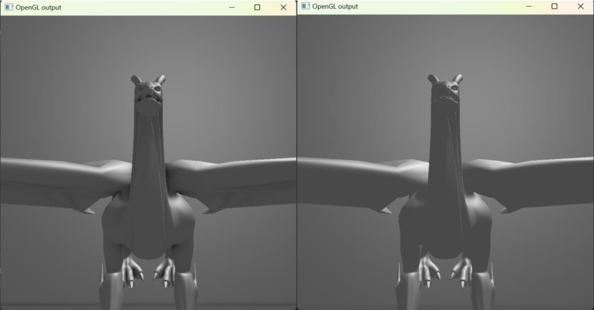

# SSAO-demo

2023春图形学大作业

> 注:键盘交互请使用英文模式
> 注:源代码文件和shader文件中有较为详细的中文注释,若显示乱码,请使用GBK编码打开
> 注:Assimp是经过裁剪的版本，只支持FBX文件的导入

## 一、文件夹说明

##### 1、build

空文件夹,用于cmake

##### 2、data

模型：/fbx
着色器代码：/shader

/shader/geometry.vs

/shader/geometry.fs 几何处理阶段的着色器

/shader/ssao.vs 画四边形共用的顶点着色器

/shader/ssao.fs 填充SSAO纹理使用的片段着色器

/shader/blur.fs 模糊SSAO纹理使用的片段着色器

/shader/lighting_ssao.fs 使用了SSAO的光照计算

/shader/lighting_nossao.fs  未使用SSAO的光照计算

##### 3、src

main.cpp    其中包含了延迟着色和SSAO大部分代码

shader.h    用于着色器的创建链接

mesh.h & model.h     用于模型读取

##### 4、third_party

使用的第三方库

## 二、编译运行

项目框架是基于小作业给的代码框架之上的, 使用cmake构建生成sln文件

之后打开./build/SSAO-demo.sln

将SSAO-demo设为启动项目,编译运行即可

## 三、功能

展示SSAO的效果

用户可以自由移动视角观察,切换渲染模式

## 四、交互

##### 鼠标:
    移动:视角移动
    滚轮:放大/缩小

##### 键盘:
    WASD:上下左右移动相机位置
    1:切换SSAO模式和普通模式(初始状态打开了SSAO)

## 四、效果

